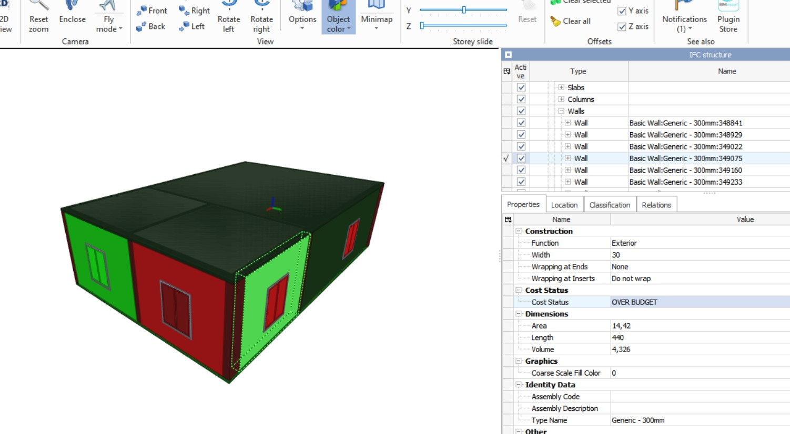

# BIM-5D-Dashboard

**Description:**
BIM-5D-Dashboard is a Python project that integrates Building Information Modeling (BIM) and cost management practices in the field of construction. It uses the IfcOpenShell library for working with Industry Foundation Classes (IFC) files and SQLite for managing cost-related data. The project facilitates cost tracking and analysis for construction projects by associating cost data with building elements in an IFC file. Key features include:

1. **Data Integration:** The project imports cost data from a JSON file and associates it with building elements in an IFC file.

2. **Cost Calculation:** It calculates costs for different building elements based on their quantities, resources, and unit prices.

3. **Cost Status:** Building elements are labeled with cost status, such as "OVER BUDGET," "ON BUDGET," or "UNDER BUDGET," based on planned and actual values.

4. **Visualization:** The project visualizes cost status by assigning colors to building elements in the IFC file. Elements are color-coded to quickly identify their cost status.

5. **Export:** The modified IFC file with cost-related properties and colors can be exported for further analysis or presentation.

6. **Open-Source:** This project is open-source, allowing developers and construction professionals to leverage the code for their own cost management needs.

By utilizing this project, construction professionals can gain valuable insights into the cost status of individual building elements within a BIM model, helping them make informed decisions and ensure projects stay within budget.

